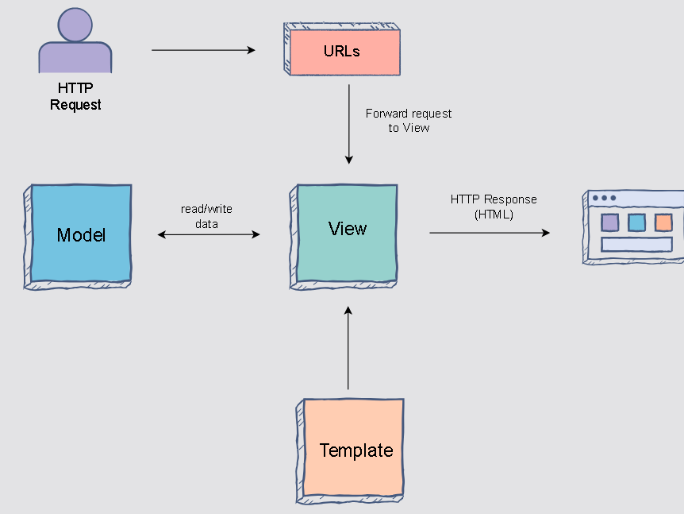

# Detailed Understanding of Django and Its Architecture (MVT)

## What is Django?

Django is a powerful, free, and open-source web framework written in Python. It is designed to help developers build web applications quickly and cleanly by providing reusable components and tools. Django handles much of the complexity involved in web development so programmers can focus on writing unique and effective application code.

### Origins and Philosophy

- Created in 2003 by developers at the Lawrence Journal-World newspaper to streamline building websites.
- Open-sourced in 2005 as “Django”.
- Emphasizes **DRY** (Don’t Repeat Yourself) principles, code reusability, and pragmatic design.
- Comes with **excellent documentation** and a large, supportive community.
- Follows a **“batteries included”** philosophy — a wide range of built-in features for common web development tasks.

---

## Key Features of Django

- **Rapid Development:** You can go from idea to product very quickly.
- **Fully Loaded:** Includes built-in modules for authentication, admin interface, content management, RSS feeds, and more.
- **Versatile:** Suitable for many types of projects: blogs, e-commerce, social networks, CMS, delivery apps, etc.
- **Secure:** Built-in protections from common vulnerabilities such as cross-site scripting (XSS), cross-site request forgery (CSRF), SQL injection, and clickjacking.
- **Scalable:** Efficiently manages high traffic and large amounts of data.
- **Extensible:** Easily extend functionality via third-party packages available through the community.

---

## The Django Architecture: Model-View-Template (MVT)

Django’s architecture is based on an adapted version of the traditional Model-View-Controller (MVC) called **Model-View-Template (MVT)**.

### Understanding the MVT Components

#### 1. Model: The Data Layer

- **Role:** Defines the structure of your data and handles all the database interactions.
- **What it does:**  
  - Describes your data in Python classes (called models).  
  - Manages creating, reading, updating, and deleting records (CRUD operations) in the database.  
  - Provides a high-level API to communicate with databases without writing SQL directly.
- **Analogy:** The puppet maker who creates and manages the puppets (data objects).

#### 2. View: The Business Logic Layer

- **Role:** Acts as the controller that processes incoming HTTP requests and decides how to respond.
- **What it does:**  
  - Receives requests from the browser or client.  
  - Communicates with models to fetch or update data as needed.  
  - Passes data to templates to prepare the final presentation.  
  - Returns HTTP responses (like HTML pages, JSON data, etc.) back to the client.
- **Analogy:** The puppeteer who controls the puppets and tells the story by deciding what scenes to show.

#### 3. Template: The Presentation Layer

- **Role:** Controls how the data is displayed to the user.
- **What it does:**  
  - Contains HTML or other text-based formats with placeholders for dynamic data.  
  - Templates are combined with data sent from views to produce the final rendered pages.  
  - Keeps design separate from business logic to promote code clarity and ease of maintenance.
- **Analogy:** The stage and backdrop — the setting where the puppet show happens.

---

### How MVT Works Together — A Web Request Flow

1. **URL Request:**  
   A user visits a webpage or interacts with the application by entering a URL or clicking a link.

2. **URL Dispatcher:**  
   Django’s URL mapper checks the URL and sends the request to the appropriate **view function**. The URL dispatcher can capture parts of the URL as parameters.

3. **View Execution:**  
   The view receives the request and:  
   - Interacts with the **model** to retrieve or modify data.  
   - Processes business logic (like validation, permissions).  
   - Selects a **template** to use for the response.

4. **Template Rendering:**  
   The template engine takes the chosen HTML template and fills in dynamic content provided by the view using context variables.

5. **Response Returned:**  
   The rendered HTML page (or JSON/XML in case of APIs) is sent back as an HTTP response to the user’s browser.

---

## Example to Illustrate MVT

Suppose you want to build a website to show a list of your favorite books.

- **Model:**  
  You create a `Book` model with properties like `title`, `author`, and `description`. This is the blueprint for storing book information in the database.

- **View:**  
  You create a view function `show_favorites()` that is called when a user visits `/favorites/`. This function queries the database for all favorite books and passes them to the template.

- **Template:**  
  You create an HTML template `favorites.html` that shows the list of books in a nice format, with titles and authors displayed.

When a user visits `/favorites/`:

- The URL dispatcher sends the request to `show_favorites()`.
- `show_favorites()` fetches the data from the Book model.
- It passes the book list to `favorites.html`.
- The template is rendered, showing a page with all favorite books.
- The user sees the nicely formatted list on their browser.

---

## Why Django’s MVT Is Useful

- **Separation of Concerns:** Each part (model, view, template) has a clear responsibility, making the code easier to understand, test, and maintain.
- **Reusability:** Models and templates can be reused in different parts of the app or even across projects.
- **Security:** By separating logic and presentation, it lowers the risk of security issues like injection attacks.
- **Productivity:** Built-in tools for URL routing, session management, forms, and templating speed up development.

---

## Django REST Framework (DRF) and APIs

- Django is not just for building websites that serve HTML; with DRF, it can create powerful RESTful APIs.
- **API Role:** APIs let other applications (mobile apps, other websites, services) communicate with your Django backend.
- When using DRF:  
  - The **view** focuses on serving data endpoints (JSON/XML).  
  - Templates are usually not used because clients directly consume data.  
  - URLs configure endpoints that respond to actions like GET (read data), POST (create), PUT/PATCH (update), DELETE (remove).
- Used by big companies like Instagram and Mozilla for building scalable APIs.

---

## So, What is Going On?
When you have installed Django and created your first Django web application, and the browser requests the URL, this is basically what happens:

1. Django receives the URL, checks the `urls.py` file, and calls the view that matches the URL.

2. The view, located in `views.py`, checks for relevant models.

3. The models are imported from the `models.py` file.

4. The view then sends the data to a specified template in the template folder.

5. The template contains HTML and Django tags, and with the data, it returns finished HTML content back to the browser.

Django can do a lot more than this, but this is basically what you will learn in this tutorial, and these are the basic steps in a simple web application made with Django.

---

## Summary Table

| Component       | Responsibility                         | Analogy         |
|-----------------|--------------------------------------|-----------------|
| **Model**       | Data structure and database access   | Puppet Maker    |
| **View**        | Business logic and request handling  | Puppeteer       |
| **Template**    | Presentation and UI rendering         | Stage/Backdrop  |
| **URL Dispatcher** | Maps URLs to views                  | Director assigning scenes |

---

## Final Thoughts

Django’s MVT architecture is designed to help developers organize their code efficiently while providing fast, secure, and scalable web development out of the box. Its clean separation between data (Model), logic (View), and presentation (Template) makes it easy to build complex web applications with maintainable and reusable code. Adding Django REST Framework extends Django’s power to serve data for any kind of client, not just web browsers.

---

