# Detailed Understanding of Django and Its Architecture (MVT)

## What is Django?

Django is a powerful, free, and open-source web framework written in Python. It is designed to help developers build web applications quickly and cleanly by providing reusable components and tools. Django handles much of the complexity involved in web development so programmers can focus on writing unique and effective application code.

### Origins and Philosophy

- Created in 2003 by developers at the Lawrence Journal-World newspaper to streamline building websites.
- Open-sourced in 2005 as “Django”.
- Emphasizes **DRY** (Don’t Repeat Yourself) principles, code reusability, and pragmatic design.
- Comes with **excellent documentation** and a large, supportive community.
- Follows a **“batteries included”** philosophy — a wide range of built-in features for common web development tasks.

---

## Key Features of Django

- **Rapid Development:** You can go from idea to product very quickly.
- **Fully Loaded:** Includes built-in modules for authentication, admin interface, content management, RSS feeds, and more.
- **Versatile:** Suitable for many types of projects: blogs, e-commerce, social networks, CMS, delivery apps, etc.
- **Secure:** Built-in protections from common vulnerabilities such as cross-site scripting (XSS), cross-site request forgery (CSRF), SQL injection, and clickjacking.
- **Scalable:** Efficiently manages high traffic and large amounts of data.
- **Extensible:** Easily extend functionality via third-party packages available through the community.

---

## The Django Architecture: Model-View-Template (MVT)

Django’s architecture is based on an adapted version of the traditional Model-View-Controller (MVC) called **Model-View-Template (MVT)**.

### Understanding the MVT Components

#### 1. Model: The Data Layer

- **Role:** Defines the structure of your data and handles all the database interactions.
- **What it does:**
  - Describes your data in Python classes (called models).
  - Manages creating, reading, updating, and deleting records (CRUD operations) in the database.
  - Provides a high-level API to communicate with databases without writing SQL directly.
- **Analogy:** The puppet maker who creates and manages the puppets (data objects).

#### 2. View: The Business Logic Layer

- **Role:** Acts as the controller that processes incoming HTTP requests and decides how to respond.
- **What it does:**
  - Receives requests from the browser or client.
  - Communicates with models to fetch or update data as needed.
  - Passes data to templates to prepare the final presentation.
  - Returns HTTP responses (like HTML pages, JSON data, etc.) back to the client.
- **Analogy:** The puppeteer who controls the puppets and tells the story by deciding what scenes to show.

#### 3. Template: The Presentation Layer

- **Role:** Controls how the data is displayed to the user.
- **What it does:**
  - Contains HTML or other text-based formats with placeholders for dynamic data.
  - Templates are combined with data sent from views to produce the final rendered pages.
  - Keeps design separate from business logic to promote code clarity and ease of maintenance.
- **Analogy:** The stage and backdrop — the setting where the puppet show happens.

---


### How MVT Works Together — A Web Request Flow

1. **URL Request:**  
   A user visits a webpage or interacts with the application by entering a URL or clicking a link.

2. **URL Dispatcher:**  
   Django’s URL mapper checks the URL and sends the request to the appropriate **view function**. The URL dispatcher can capture parts of the URL as parameters.

3. **View Execution:**  
   The view receives the request and:

   - Interacts with the **model** to retrieve or modify data.
   - Processes business logic (like validation, permissions).
   - Selects a **template** to use for the response.

4. **Template Rendering:**  
   The template engine takes the chosen HTML template and fills in dynamic content provided by the view using context variables.

5. **Response Returned:**  
   The rendered HTML page (or JSON/XML in case of APIs) is sent back as an HTTP response to the user’s browser.

---

## Example to Illustrate MVT

Suppose you want to build a website to show a list of your favorite books.

- **Model:**  
  You create a `Book` model with properties like `title`, `author`, and `description`. This is the blueprint for storing book information in the database.

- **View:**  
  You create a view function `show_favorites()` that is called when a user visits `/favorites/`. This function queries the database for all favorite books and passes them to the template.

- **Template:**  
  You create an HTML template `favorites.html` that shows the list of books in a nice format, with titles and authors displayed.

When a user visits `/favorites/`:

- The URL dispatcher sends the request to `show_favorites()`.
- `show_favorites()` fetches the data from the Book model.
- It passes the book list to `favorites.html`.
- The template is rendered, showing a page with all favorite books.
- The user sees the nicely formatted list on their browser.

---

## Why Django’s MVT Is Useful

- **Separation of Concerns:** Each part (model, view, template) has a clear responsibility, making the code easier to understand, test, and maintain.
- **Reusability:** Models and templates can be reused in different parts of the app or even across projects.
- **Security:** By separating logic and presentation, it lowers the risk of security issues like injection attacks.
- **Productivity:** Built-in tools for URL routing, session management, forms, and templating speed up development.

---

## Django REST Framework (DRF) and APIs

- Django is not just for building websites that serve HTML; with DRF, it can create powerful RESTful APIs.
- **API Role:** APIs let other applications (mobile apps, other websites, services) communicate with your Django backend.
- When using DRF:
  - The **view** focuses on serving data endpoints (JSON/XML).
  - Templates are usually not used because clients directly consume data.
  - URLs configure endpoints that respond to actions like GET (read data), POST (create), PUT/PATCH (update), DELETE (remove).
- Used by big companies like Instagram and Mozilla for building scalable APIs.

---

## So, What is Going On?

When you have installed Django and created your first Django web application, and the browser requests the URL, this is basically what happens:

1. Django receives the URL, checks the `urls.py` file, and calls the view that matches the URL.

2. The view, located in `views.py`, checks for relevant models.

3. The models are imported from the `models.py` file.

4. The view then sends the data to a specified template in the template folder.

5. The template contains HTML and Django tags, and with the data, it returns finished HTML content back to the browser.

Django can do a lot more than this, but this is basically what you will learn in this tutorial, and these are the basic steps in a simple web application made with Django.

---

## Summary Table

| Component          | Responsibility                      | Analogy                   |
| ------------------ | ----------------------------------- | ------------------------- |
| **Model**          | Data structure and database access  | Puppet Maker              |
| **View**           | Business logic and request handling | Puppeteer                 |
| **Template**       | Presentation and UI rendering       | Stage/Backdrop            |
| **URL Dispatcher** | Maps URLs to views                  | Director assigning scenes |

---

## Final Thoughts

Django’s MVT architecture is designed to help developers organize their code efficiently while providing fast, secure, and scalable web development out of the box. Its clean separation between data (Model), logic (View), and presentation (Template) makes it easy to build complex web applications with maintainable and reusable code. Adding Django REST Framework extends Django’s power to serve data for any kind of client, not just web browsers.

**What is an App?**
An app is a web application that has a specific meaning in your project, like a home page, a contact form, or a members database.

In this tutorial we will create an app that allows us to list and register members in a database.What is an App?
An app is a web application that has a specific meaning in your project, like a home page, a contact form, or a members database.

In this tutorial we will create an app that allows us to list and register members in a database.

But first, let's just create a simple Django app that displays "Hello World!".

python manage.py startapp hello-world

Here's your in-depth explanation of **Static vs. Dynamic Routing in Django** saved in `.md` (Markdown) format:

---

````markdown
# 🧭 Django Routing: Static vs Dynamic (In-Depth)

Django’s routing system is how URLs are mapped to specific views. This is handled using the `urls.py` file of a Django project or app.

---

## 📌 Static Routing

### 🔍 What is Static Routing?

In **static routing**, we specify **fixed URL patterns** in `urls.py`. These are **hardcoded paths** that do not change and do **not accept any variable parameters**.

### 📂 Code Example: Static Routing

```python
# first_project/urls.py

from django.contrib import admin
from django.urls import path
from first_app import views

urlpatterns = [
    path('', views.index, name="index"),
    path('home/', views.home, name="home"),
    path('educative/', views.educative, name="educative"),
    path('admin/', admin.site.urls),
]
```
````

- `path('home/', views.home, name="home")`: Matches exactly `/home/`
- `path('educative/', views.educative, name="educative")`: Matches exactly `/educative/`

> ✅ **NOTE:** Paths in Django are **case-sensitive**. So `/educative` and `/Educative` are treated as different URLs.

### 🧪 Try It Out

Run your server and visit:

- `/home/`
- `/educative/`

You will see the content served from their respective views.

---

## 🔄 Dynamic Routing

### 🔍 What is Dynamic Routing?

In **dynamic routing**, URL patterns include **variables** that act as placeholders. These allow us to capture parts of the URL and pass them as parameters to the corresponding view functions.

### 🔣 Syntax for Dynamic Routes

To declare a dynamic segment in a path:

```python
path('<variable_name>/', view_function)
```

Django uses angle brackets (`< >`) to indicate dynamic parameters.

---

### 📂 Code Example: Dynamic Routing

```python
# first_project/urls.py

from django.contrib import admin
from django.urls import path
from first_app import views

urlpatterns = [
    path('', views.index, name="index"),
    path('<age>/', views.show_age, name="show_age"),
    path('admin/', admin.site.urls),
]
```

```python
# first_app/views.py

from django.http import HttpResponse

def index(request):
    return HttpResponse("Welcome to the homepage!")

def show_age(request, age):
    return HttpResponse("You are %s years old." % age)
```

### 🧠 Explanation:

- `'<age>/'`: This captures the URL segment after the domain and passes it to the view function.
- `show_age(request, age)`: The `age` parameter receives the captured value.
- The response will include the dynamic value passed via the URL.

> Example URLs and output:
>
> - `/18` → "You are 18 years old."
> - `/123` → "You are 123 years old."

---

## 🔄 Comparison Table

| Feature       | Static Routing                | Dynamic Routing                           |
| ------------- | ----------------------------- | ----------------------------------------- |
| URL Pattern   | Fixed                         | Includes variables                        |
| Example Path  | `path('home/', views.home)`   | `path('<age>/', views.show_age)`          |
| View Function | No parameters                 | Accepts parameters                        |
| Flexibility   | Less flexible                 | Highly flexible                           |
| Use Case      | Static pages like Home, About | Data-driven pages like profiles, articles |

---

## ✅ Summary

- **Static routing** is simple and best for fixed pages.
- **Dynamic routing** makes your application more powerful by allowing variable content through URLs.

Together, they allow Django to create rich, responsive, and flexible web applications.

# 🔀 Django Routing: Dynamic Routing with Path Converters & Modular URL Mapping

---

## 🧭 Dynamic Routing with Path Converters

### 🔍 What Are Path Converters?

In Django, **path converters** are used with **dynamic routing** to automatically **cast variables in the URL** to specific data types before passing them to the view functions.

By default, dynamic path variables (e.g., `<age>`) are treated as **strings**. But you can **use converters like `<int:age>`** to automatically cast `age` to an integer.

---

### 🔣 Available Path Converters

| Converter | Matches                                | Example URL          |
| --------- | -------------------------------------- | -------------------- |
| `str`     | Non-empty string excluding `/`         | `/hello/` → "hello"  |
| `int`     | Positive integers (including 0)        | `/23/` → 23          |
| `slug`    | Letters, numbers, hyphens, underscores | `/my-post-1/`        |
| `uuid`    | Valid UUID format                      | `/a12bc34d-56ef.../` |
| `path`    | Non-empty string **including** `/`     | `/a/b/c/` → "a/b/c"  |

> 🧠 Use the appropriate converter for your use case — such as `int` for numerical calculations and `slug` for SEO-friendly article titles.

---

### 📂 Example Code: Using `<int:num>` in Dynamic Routing

```python
# first_project/urls.py

from django.contrib import admin
from django.urls import path
from first_app import views

urlpatterns = [
    path('', views.index, name="index"),
    path('<int:num>/', views.even_or_odd, name="even_or_odd"),
    path('admin/', admin.site.urls),
]

# first_app/views.py

from django.http import HttpResponse

def index(request):
    return HttpResponse("Welcome to the Homepage!")

def even_or_odd(request, num):
    if num % 2 == 0:
        output = f"{num} is an even number."
    else:
        output = f"{num} is an odd number."
    return HttpResponse(output)

```

### 🧪 Try This

Run the server and open the app in a new tab:

- Visit `/3` → Output: `3 is an odd number.`
- Visit `/10` → Output: `10 is an even number.`
- Visit `/abc` → ❌ Error: Path converter expects an integer.

---

## 📦 Modular URL Mapping using `include()`

---

### ⚙️ Problem with Non-Modular URL Mapping

In earlier examples, we defined all paths in the **project's `urls.py` file** like this:

<pre>
path('', views.index, name="index"),
path('home/', views.home, name="home"),
path('educative/', views.educative, name="educative"),
</pre>

This approach becomes unmanageable as your project grows and multiple apps are introduced.

---

### ✅ Solution: Use `include()` for Modular Mapping

Django provides the `include()` function to delegate URL routing to individual app-level `urls.py` files.

---

### 📂 Step-by-Step Guide to Using `include()`

---

#### ✅ Step 1: Update Project’s `urls.py`

<pre>
# first_project/urls.py

from django.contrib import admin
from django.urls import path, include

urlpatterns = [
    path('', include('first_app.urls')),  # Delegating all URLs to app
    path('admin/', admin.site.urls),
]
</pre>

> ✅ Now all root-level paths (`/`, `/home/`, etc.) will be handled by `first_app.urls`.

---

#### ✅ Step 2: Create `urls.py` in Your App (if not present)

<pre>
# first_app/urls.py

from django.urls import path
from first_app import views

urlpatterns = [
    path('', views.index, name="index"),
    path('home/', views.home, name="home"),
    path('educative/', views.educative, name="educative"),
]
</pre>

### 🌐 Example: Nested URL Delegation

Suppose we have a `profiles` app. Instead of:

##### ❌ Not recommended (in project urls.py)

<pre>
path('profile/admin/<int:id>/', profiles.views.admin),
</pre>

We should do:

<pre>
# ✅ In project urls.py
path('profile/', include('profiles.urls'))

> Then in `profiles/urls.py`:

from django.urls import path
from . import views

urlpatterns = [
    path('admin/<int:id>/', views.admin_view),
    path('user/<int:id>/', views.user_view),
]
</pre>

> 🔁 This sends all `/profile/...` paths to `profiles/urls.py`, making the project modular and scalable.

---

## ✅ Summary

| Feature                        | Without `include()`                  | With `include()`                   |
| ------------------------------ | ------------------------------------ | ---------------------------------- |
| Structure                      | Centralized, messy as project grows  | Modular, maintainable per app      |
| Project-level `urls.py`        | All URL logic defined here           | Delegates app-specific paths       |
| App-level `urls.py`            | Not required, not created by default | Required, must be created manually |
| Recommended for Large Projects | ❌ No                                | ✅ Yes                             |

---

## 🚀 Final Note

- Always **modularize** your project URLs using `include()` for better scalability.
- Use **path converters** to ensure URL values are type-safe and logic-ready.
- Keep your `urls.py` clean and organized for long-term maintenance.

---

## 🖥️ Run the Server

python manage.py runserver

---

# 🌐 Understanding Django Request → View → Template Communication

This document explains the full cycle of how Django handles a request and passes data from `views.py` to an HTML `template` — step by step with proper mind mapping and examples.

---

## 🧠 Mind Map: Full Flow

```mermaid
graph TD
    A["📍 Browser Makes Request"]
    A --> B["🌐 URL is hit (e.g., /?name=Prithu)"]
    B --> C["🛰️ HTTP Request sent to Django"]
    C --> D["📩 Django gets request object (HttpRequest)"]
    D --> E["🎯 View Function Receives It"]
    E --> F["📦 request.GET.get('key', 'default')"]
    F --> G["🛠️ Data Processed in View"]
    G --> H["📤 Data passed to Template"]
    H --> I["🧾 HTML Rendered & Sent Back"]
```



---

## 🧱 Step-by-Step Breakdown

---

### ✅ STEP 1: User Sends Request from Browser

**Example URL:**

```
http://localhost:8000/?name=Prithu
```

- This sends an **HTTP GET request** to your Django app.
- `?name=Prithu` is the query parameter.

---

### ℹ️ Why is there a '?' in '?name=Prithu'?

The `?` in a URL marks the start of query parameters. Everything after the `?` is a key-value pair sent to the server. For example, in:

```
http://localhost:8000/?name=Prithu
```

- `/` is the path.
- `?name=Prithu` is the query string, where `name` is the parameter and `Prithu` is its value.

Django lets you access this value in your view using `request.GET.get("name")`. This is how the server knows to greet you with "Hello Prithu!" if you visit that URL.

---

### ✅ STEP 2: Django Matches URL

```python
# urls.py
path('', views.home, name='home')
```

This matches `/` and routes the request to `home()` view in `views.py`.

---

### ✅ STEP 3: View Function Receives `request`

```python
# views.py
def home(request):
    name = request.GET.get("name", "Guest")
    return render(request, 'demo_app/home.html', {'name': name})
```

🧠 `request` is an instance of `HttpRequest`, containing:

| Attribute        | Description                               |
| ---------------- | ----------------------------------------- |
| `request.GET`    | Query parameters from URL (GET request)   |
| `request.POST`   | Data from HTML forms (POST request)       |
| `request.user`   | The currently logged-in user (if any)     |
| `request.method` | HTTP method used: `'GET'`, `'POST'`, etc. |

---

### ✅ STEP 4: Extract Query Parameter with Fallback

```python
name = request.GET.get("name", "Guest")
```

- If `?name=Prithu` → `name = "Prithu"`
- If not present → `name = "Guest"`

✅ `get("key", default)` prevents errors and ensures a fallback value.

---

### ✅ STEP 5: Pass Data to Template

```python
return render(request, 'demo_app/home.html', {'name': name})
```

- `render()` takes:
  - `request`: the HttpRequest object
  - `'demo_app/home.html'`: the template file
  - `context`: a Python dictionary passed to the template

---

### ✅ STEP 6: Template Displays Data

```html
<!-- demo_app/templates/demo_app/home.html -->
<!DOCTYPE html>
<html>
  <head>
    <title>Home</title>
  </head>
  <body>
    <h2>Hello {{ name }}!</h2>
  </body>
</html>
```

✅ Output:

- If `?name=Prithu` → `Hello Prithu!`
- If not → `Hello Guest!`

---

## 🔄 Full Lifecycle Flow Recap

```plaintext
🌐 User hits URL → 🛰️ Django receives request →
📨 View gets request object →
📦 Extracts data from request.GET →
🧠 Applies logic or default values →
📤 Sends data to template with render() →
🧾 Template displays {{ name }} →
📡 Final HTML is sent to user
```

---

## 🧠 Mental Model Summary Table

| Layer    | Role                                 | Example                            |
| -------- | ------------------------------------ | ---------------------------------- |
| URL      | Triggers a specific view             | `/`, `/?name=Prithu`               |
| View     | Processes request & prepares context | `request.GET.get("name", "Guest")` |
| Template | Displays passed data                 | `{{ name }}`                       |
| Browser  | Shows final rendered HTML            | `Hello Prithu!`                    |

---

## 🧪 Try It Yourself!

**Start your local server:**

```bash
python manage.py runserver
```

**Visit URLs:**

- `http://localhost:8000/?name=Prithu` → Output: `Hello Prithu!`
- `http://localhost:8000/` → Output: `Hello Guest!`

---

## 📌 Conclusion

✅ This is how Django seamlessly connects:

- 🌐 Frontend input (via query or form)
- 🧠 Backend logic (in `views.py`)
- 🖼️ HTML rendering (in templates)

You now understand how requests are **handled**, **processed**, and **passed forward** in Django from browser to template!
